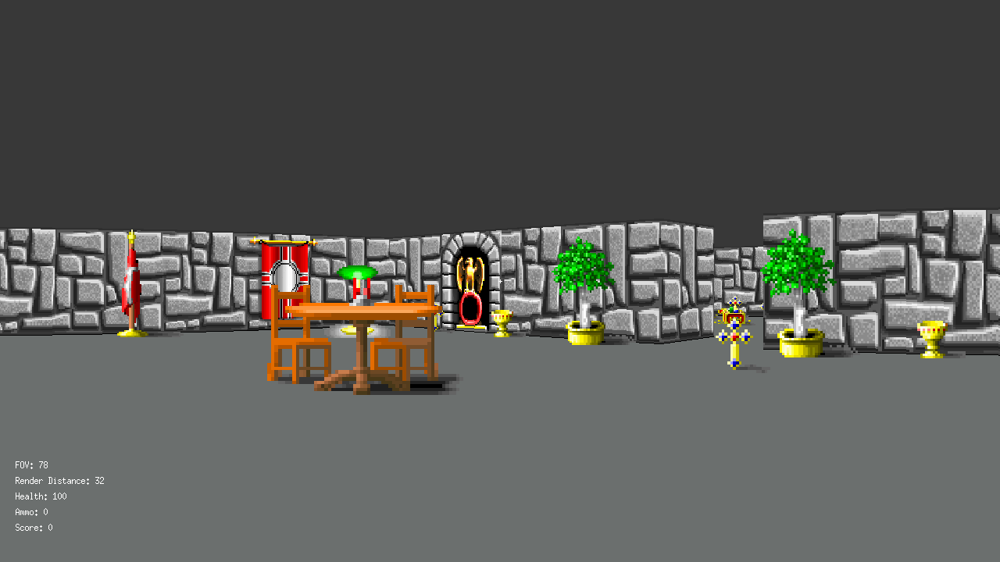
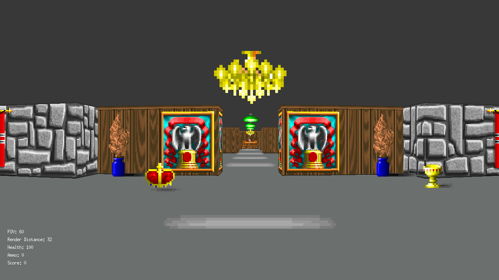
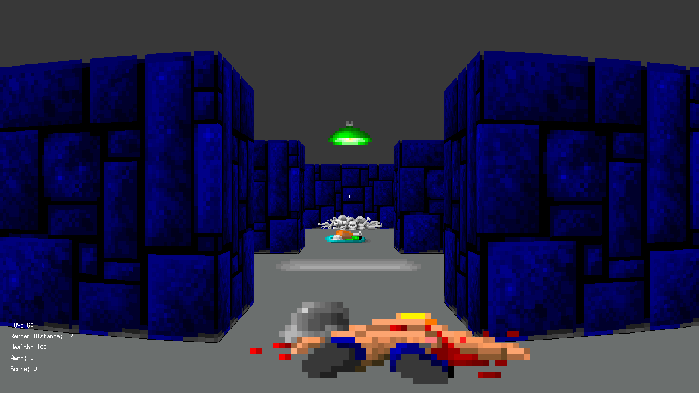

# Wolf3D

**Wolf3d** is a Wolfenstein3D-style renderer based on raycasting technique. 
**Features**: multithread rendering, textures, wall collisions, collectable items, items collisions  

## **Screenshots**

